# Secure Cloud Infrastructure & DevSecOps Platform

A hardened AWS "landing zone" built entirely with Terraform, running a containerized Flask application on EKS behind an Application Load Balancer, wrapped in AWS's native security tooling, and backed by a five stage security pipeline in GitHub Actions.

I built this project to go beyond studying cloud security concepts in the abstract and actually put them into practice. Every service, decision, and incident described below is real. I hit real errors, made real architectural tradeoffs, and documented the reasoning behind each one, not just the final state.

## What This Project Does

The project has three layers that work together.

**Infrastructure layer.** A custom VPC with public and private subnets across two Availability Zones, NAT Gateways, and an EKS cluster with a managed node group, all defined as code in Terraform. No resource was clicked into existence through the console.

**Security layer.** AWS's native security services wired directly into that infrastructure: CloudTrail for audit logging, GuardDuty for threat detection, Security Hub for compliance scoring against the CIS AWS Foundations Benchmark, Macie for sensitive data discovery, AWS Config for configuration drift detection, Amazon Inspector for continuous image scanning, and a WAF Web ACL enforcing three managed rule sets in front of the application.

**Delivery layer.** A Dockerized Flask app, deployed to EKS behind an AWS Application Load Balancer provisioned by the AWS Load Balancer Controller, with a GitHub Actions pipeline that runs Trivy, Checkov, Semgrep, OWASP Dependency Check, and SBOM generation on every push to main.

## Why It Matters

This project maps directly to real job requirements for cloud security and DevSecOps roles: identity and access design, detection and compliance tooling, network segmentation, container hardening, vulnerability triage, and security automation, all built and debugged end to end by one person rather than assembled from a tutorial.

I have also deliberately cross mapped the AWS services here to their Microsoft equivalents (Entra ID, Defender, Sentinel, Azure Policy) throughout my own notes, since the underlying concepts of least privilege, Zero Trust, and detection engineering are the same regardless of which cloud a job happens to run on.

## Architecture

```
                              Internet
                                 |
                        Application Load Balancer
                        (WAF Web ACL attached)
                                 |
                    +------------------------+
                    |   Public Subnets (2 AZ) |
                    |   NAT Gateways, IGW     |
                    +------------------------+
                                 |
                    +------------------------+
                    |  Private Subnets (2 AZ) |
                    |  EKS Node Group          |
                    |  Flask App (non root)    |
                    +------------------------+

    CloudTrail -> S3 (KMS encrypted)      GuardDuty (EKS runtime monitoring)
    AWS Config -> S3                       Security Hub (CIS benchmark)
    Macie (S3 scanning)                    Inspector (ECR scanning)
```

## Security Services Implemented

| Service | Purpose | Key Configuration |
|---|---|---|
| CloudTrail | Account wide audit trail | Multi region, KMS encrypted, log file validation enabled |
| GuardDuty | Threat and anomaly detection | EKS runtime monitoring and malware protection enabled |
| Security Hub | Compliance scoring | Subscribed specifically to CIS AWS Foundations Benchmark v1.4.0 |
| Macie | Sensitive data discovery | Classification job on the CloudTrail log bucket |
| AWS Config | Configuration drift detection | Recorder and delivery channel across all supported resource types |
| WAF | Application layer filtering | Common Rule Set, Known Bad Inputs, and SQL Injection rule groups |
| Amazon Inspector | Vulnerability scanning | Continuous scanning on ECR image pushes |

## Before and After

### Container vulnerability remediation

Switching the base image from `python:3.11-slim` to `python:3.11-alpine` was an attack surface reduction decision, not a patching exercise. The before image carried 17 vulnerabilities, several of them Critical, in packages the application never actually used.

**Before (Debian slim base image, 17 vulnerabilities)**

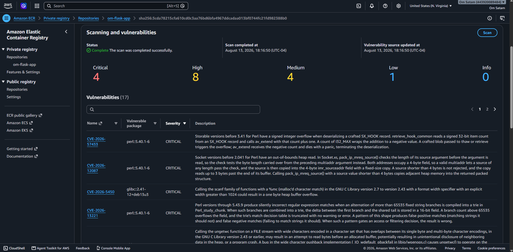

**After (Alpine base image, 0 vulnerabilities)**

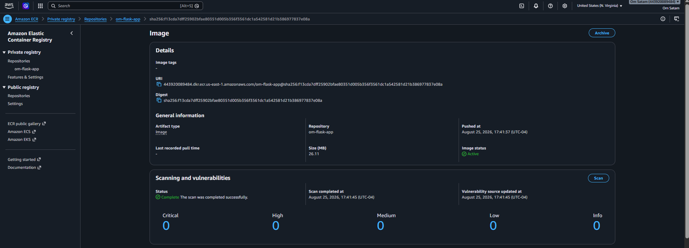

### WAF hardening

The Web ACL was originally built with two managed rule groups covering common exploits and known bad inputs, but nothing was logging its decisions and no rule specifically covered SQL injection. Testing a real SQL injection style request against the original configuration got through untouched. I added AWS's dedicated SQL Injection rule set and enabled logging to CloudWatch.

**Before (2 rules, logging not enabled)**

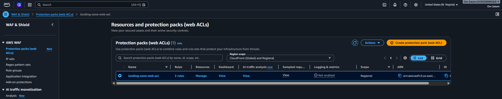

**After (3 rules including SQLi, CloudWatch logging enabled)**

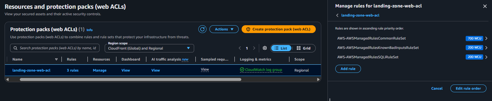

To confirm the fix actually worked rather than just applying cleanly, I sent a real SQL injection payload against the live Application Load Balancer and checked both the response and the log.

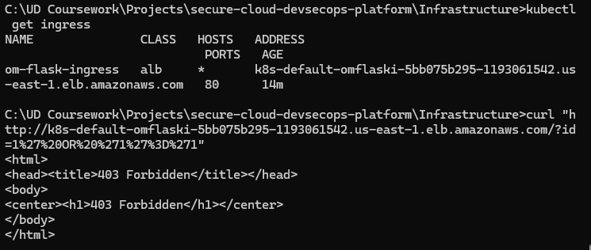

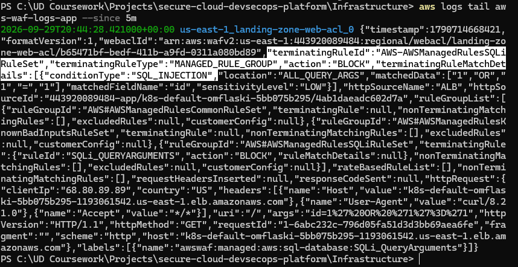

The log entry shows `AWS-AWSManagedRulesSQLiRuleSet` terminating the request, the condition type `SQL_INJECTION`, and the exact field and pattern that matched. That is a genuine, provable block, not just a passing Terraform apply.

### Load balancer architecture

The EKS Service was originally exposed with `type: LoadBalancer`, which provisions a Classic Load Balancer by default on EKS. AWS WAF v2 cannot attach to a Classic Load Balancer, it only supports an Application Load Balancer, CloudFront, or API Gateway. Rather than work around that limitation, I installed the AWS Load Balancer Controller, set up IAM Roles for Service Accounts so the controller runs with its own narrowly scoped IAM role instead of inheriting the node's broad permissions, and switched the app to a Kubernetes Ingress so the controller provisions a real Application Load Balancer.

**Before (Classic Load Balancer)**

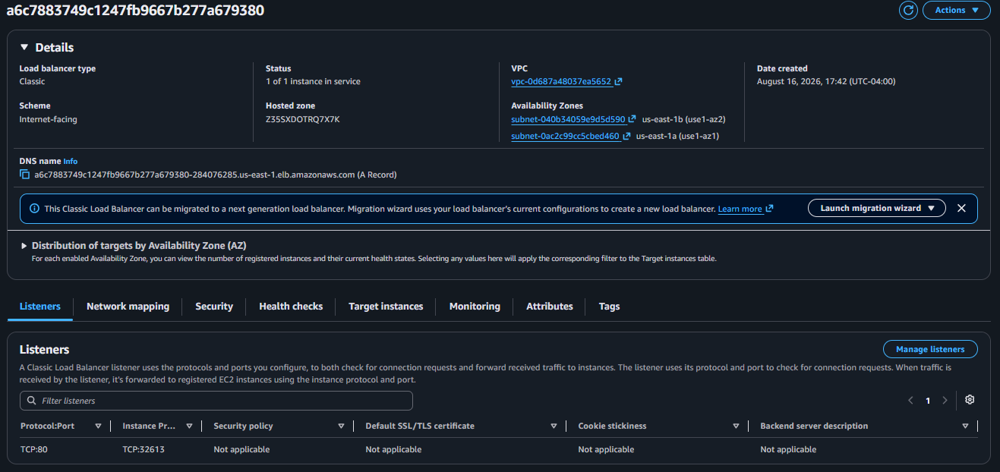

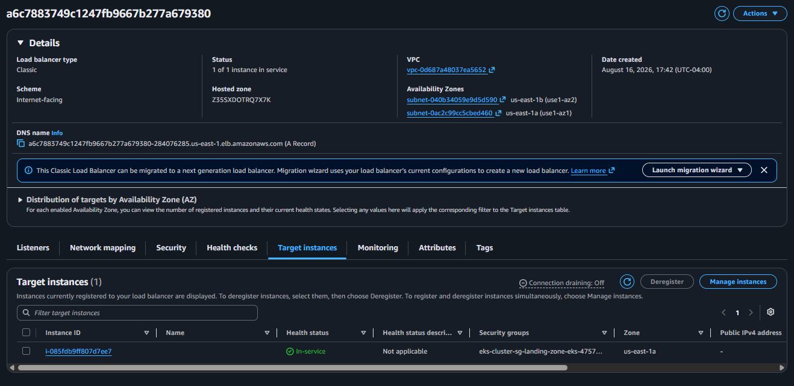

**After (Application Load Balancer via Ingress)**

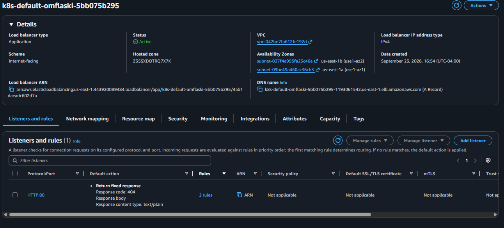

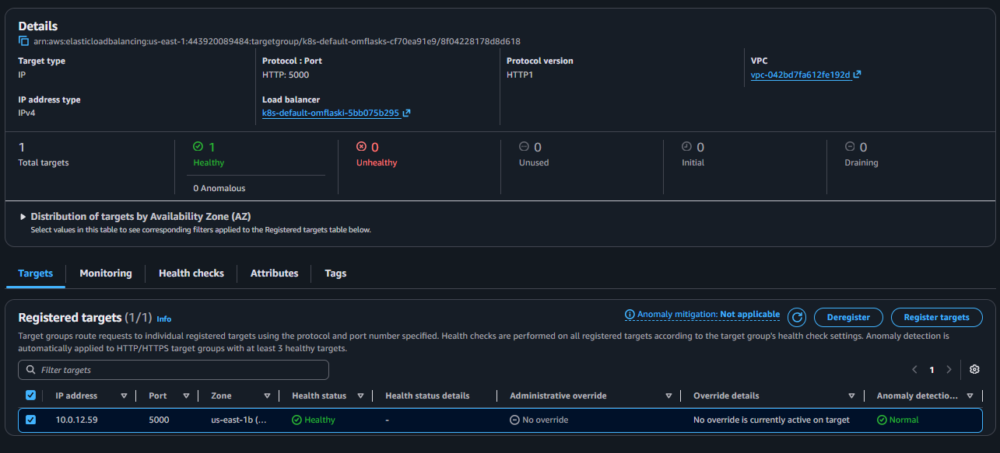

The application itself did not change at all between these two architectures. Same pod, same port, same response.

**Before, app served through the Classic Load Balancer**

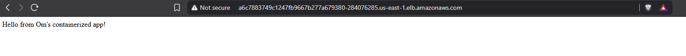

**After, app served through the Application Load Balancer**

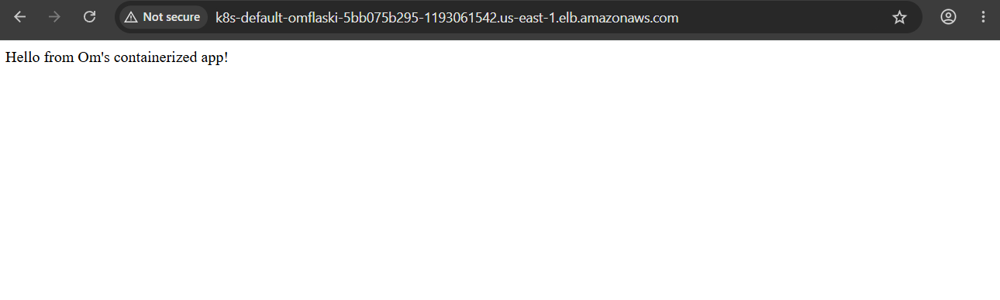

### Security Hub, before real evaluation and after

Before the CIS benchmark subscription actually finished provisioning, Security Hub could not display a score at all. Once it was correctly subscribed, it began evaluating the account against real controls.

**Before**

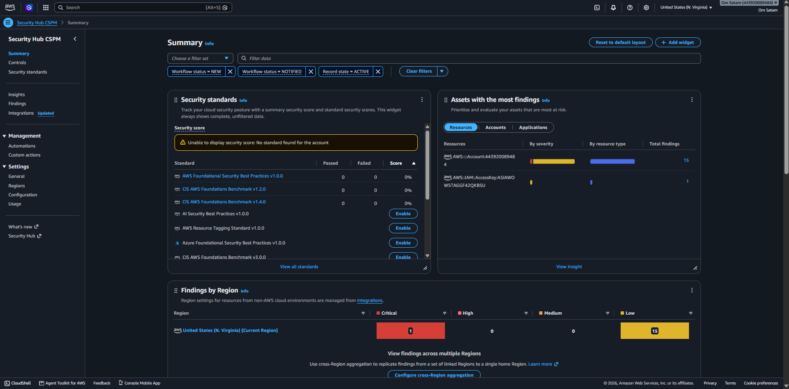

**After**

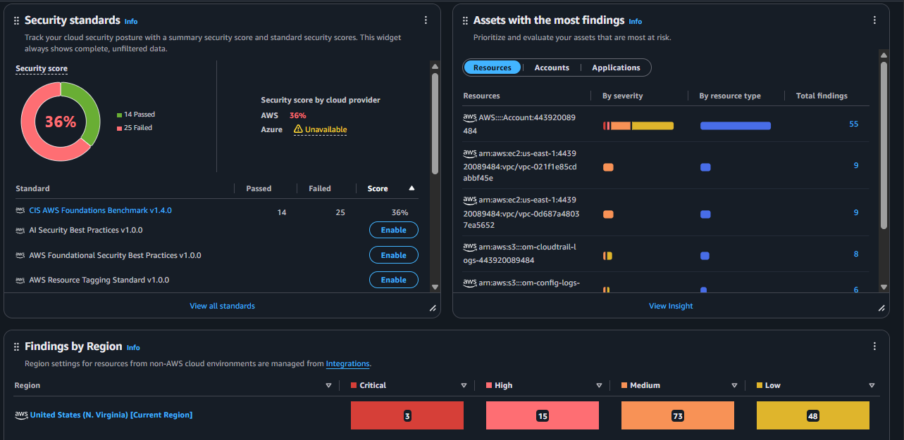

The CIS benchmark score of 36 percent reflects a real, unfiltered evaluation against the entire account, not a curated demo. The three Critical findings it surfaces all require hardware MFA on the root account. I made a deliberate, documented decision not to purchase a hardware key for this account, since virtual MFA provides substantially equivalent protection at this scale and a physical key is not a proportionate control for a personal lab environment. Security Hub independently confirming that exact gap is, if anything, evidence that the tooling and my own risk assessment agree.

## CI/CD Security Pipeline

Every push to main runs five independent jobs in GitHub Actions.

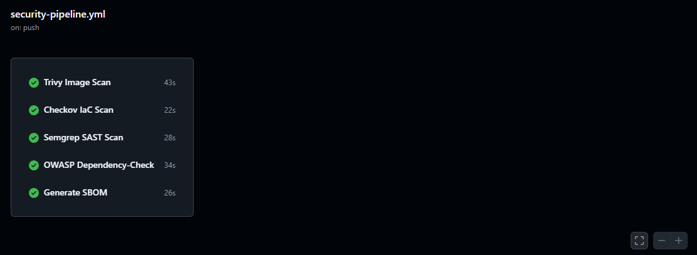

| Job | What It Actually Checks |
|---|---|
| Trivy | Vulnerabilities in the built container image |
| Checkov | Misconfigurations in the Terraform code itself |
| Semgrep | Insecure patterns in the application source code |
| OWASP Dependency Check | Declared Python dependencies against the National Vulnerability Database |
| SBOM Generation | A complete CycloneDX inventory of the built image, generated with Syft |

These five tools were chosen deliberately rather than picking one scanner and calling it done. Each one sees a layer the others structurally cannot. Trivy only knows the final image, Checkov only knows the infrastructure code, Semgrep only knows the application source, and Dependency Check pulls from an entirely different vulnerability database than Trivy does.

## Real Incidents I Debugged

I am including these because they were the most instructive part of the project and are the kind of specific detail that is hard to fake in an interview.

**Load balancer unreachable.** Isolated the cause methodically: a port forward test ruled out the application itself, a target health check ruled out security groups, and checking cross zone load balancing settings revealed a single AZ node placement with cross zone balancing disabled, meaning roughly half of all requests were silently hitting nothing. The final root cause was a terminal line wrap that had truncated a copied DNS hostname.

**ECR immutable tag surprise.** With `image_tag_mutability` set to `IMMUTABLE`, pushing a new image under the `latest` tag silently failed to update anything. I diagnosed it by comparing image digests and timestamps, then adopted explicit version tags (`v2`, `v3`, `v4`) as permanent practice.

**Terraform state drift.** After re enabling a cost controlled portion of the infrastructure, `terraform apply` produced a wave of "already exists" errors. The local state file had lost track of resources that were still genuinely alive in AWS. I resolved it with a series of `terraform import` commands, and in the process found two real configuration bugs that had been hidden by the drift.

**Kubernetes non root enforcement.** The Dockerfile originally switched to a non root user before the steps that still needed root, and used a named user rather than a numeric UID, which Kubernetes cannot statically verify. Both had to be fixed before `runAsNonRoot` would allow the pod to start at all.

**Ingress pointing at the wrong port.** The Ingress backend referenced the pod's internal `targetPort` instead of the Service's actual exposed `port`, which is an easy mistake to make and a useful one to have made once.

## Known Limitations

The Application Load Balancer only has an HTTP listener. Adding HTTPS would require an ACM certificate tied to a real domain name, which is out of scope for a project with no owned domain. Hardware MFA on the root account was deliberately not implemented for the reasons described above. Node group sizing is intentionally small (`t3.small`, one to two nodes) since this is a portfolio project, not a production workload.

## Repository Structure

```
Infrastructure/    Terraform configuration (VPC, IAM, EKS, security services, IRSA)
App/               Flask application, Dockerfile, Kubernetes manifests
.github/workflows/ CI/CD security pipeline
screenshots/        Evidence referenced in this README
```

## Technologies Used

Terraform, AWS (VPC, IAM, EKS, ECR, CloudTrail, GuardDuty, Security Hub, Macie, Config, WAF v2, Inspector, ALB), Docker, Kubernetes, Helm, the AWS Load Balancer Controller, GitHub Actions, Trivy, Checkov, Semgrep, OWASP Dependency Check, and Syft.
